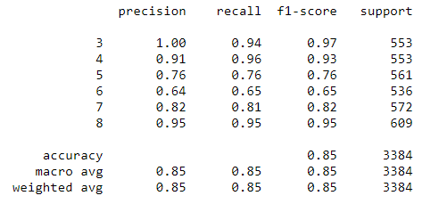

## CS6140 Project Wine Quality Prediction

This project is to evaluate the KNN/Neural Network/Gradient Boosting Tree multi classifiers and choose the best one to determin the importance of feature for wine quality prediction.

The Gradient Boosting Classifier has the best f1-score 85% and was used to determin feature importance.

Please running the wine_quality_prediction.ipynb to see the analysis and result.

